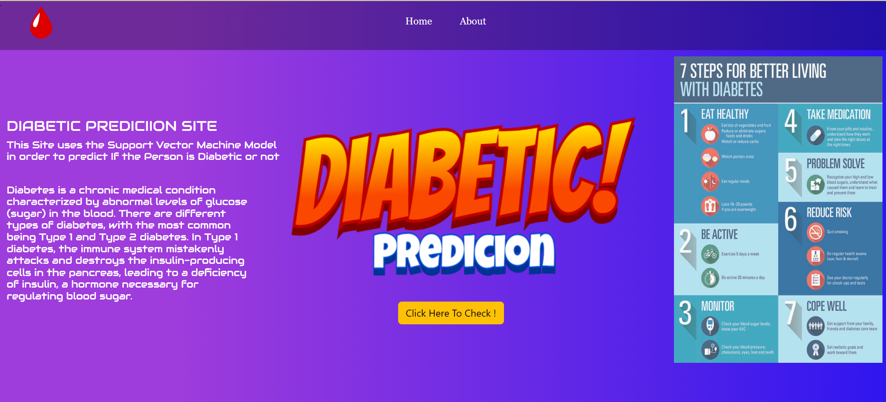

# Diabetics-Prediction-Using-Django-Machine Learning

___________________________________________________________________________________________________________________________________________________________

This Model is Created Using the Pythons Popular Webframework i.e Django and Using the Support Vector Machine Model to Predict the Outcomes Based On the Inputs Given by the User

## Input To the Model
+ Pregnency (integer)
+ Glucose
+ Blood Preasure (integer)
+ Skin Thickness (integer)
+ Insulin
+ BMI
+ Diabetics Pedegree Function
+ Age

Model Takes the Following Inputs Based Over the WebPage and Predicts the Output!

## Application:
Quite Commonly It Can be Used By the Medical Practicioners and Doctors

## How to Run On Your Mahine?:
> **_NOTE:_**  Do have Python Installed in Your System and Enter Following Commands in Your Commandline
### 1.Install Django by
```
pip install django
```
### 2.Clone this Repo to Your System

### 3.Go Into Diabetics Folder and Run the manage.py by django

```
cd diabetics 
py manage.py runserver 
```

### 4.Hence The Webserver Should Run at http://127.0.0.1:8000/, Go to Your Browser and Enter the IP and Appliction Should be Visible like Below




do contact @kinderasteroid for Help,Support,Assistance


## Project-Contributtors
> Suhas S Bhandary and 
> Varsha V Shetty

